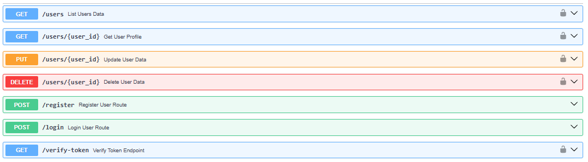

# MicroCart
Scalable Microservice Architecture for E-Commerce

This project focuses on developing a backend system for a simple e-commerce platform using microservice architecture and AWS services. It will implement various microservices, including User Management, Product and Cart Management, and Image Storage. The project includes user authentication with JWT, product management with DynamoDB, and image storage on S3. Additionally, a CI/CD pipeline will be implemented for automated testing and deployment, with CloudWatch for application monitoring. The system will be containerized using Docker, deployed on AWS ECS, and scaled automatically based on traffic.

## USER SERVICE API 
http://localhost:8001/docs#/

## PRODUCT SERVICE API 
http://localhost:8002/docs#/

## CART SERVICE API 
http://localhost:8003/docs#/

