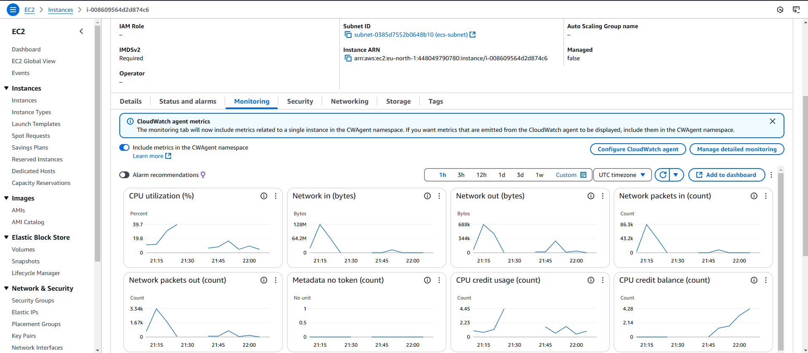
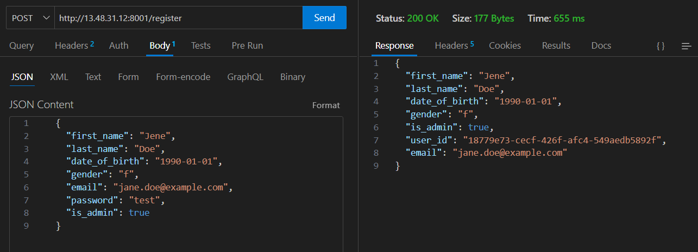
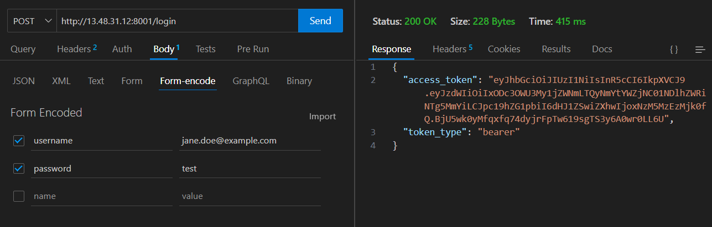

# MicroCart
Scalable Microservice Architecture for E-Commerce

This project focuses on developing a backend system for a simple e-commerce platform using microservice architecture and AWS services. It implements various microservices, including User Management, Product and Cart Management. The project includes user authentication with JWT, product management with DynamoDB, and image storage on S3/localstack. The system will be containerized using Docker, deployed on AWS ECS with CloudWatch for application monitoring.

> [!CAUTION]
> EC2 temporary disabled because free version is not enough to run the app

> [!TIP]
> Clone the project and use "docker-compose up --build" to run locally

## USER SERVICE API 
http://13.48.31.12:8001/docs#/

## PRODUCT SERVICE API 
http://13.48.31.12:8002/docs#/

## CART SERVICE API 
http://13.48.31.12:8003/docs#/

## Monitoring

## example to test

### register user

### login and use token for other endpoints

